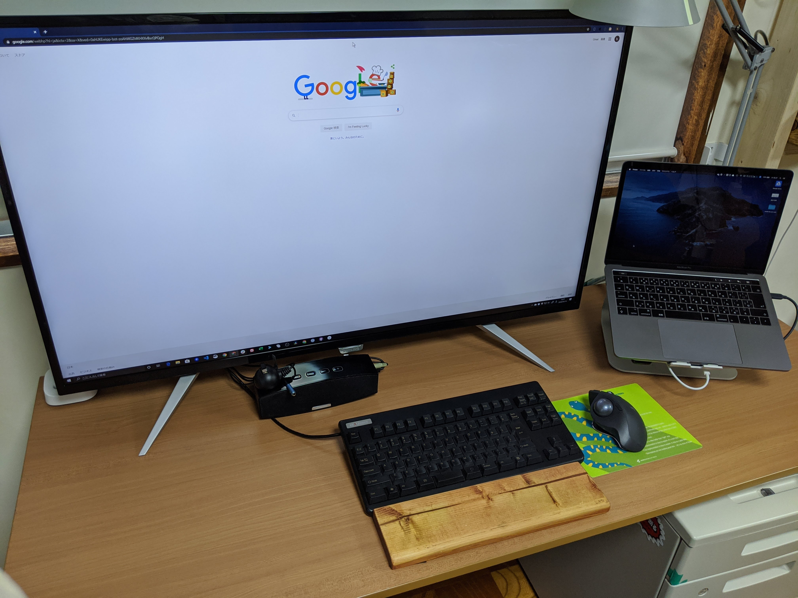
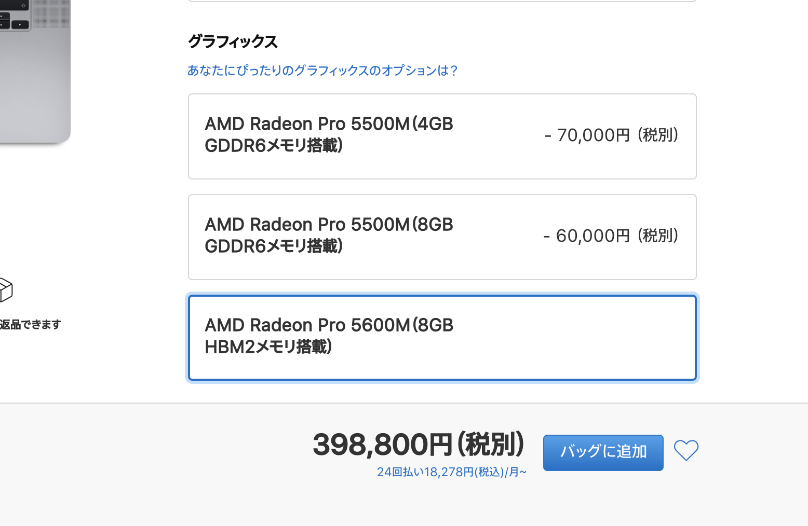
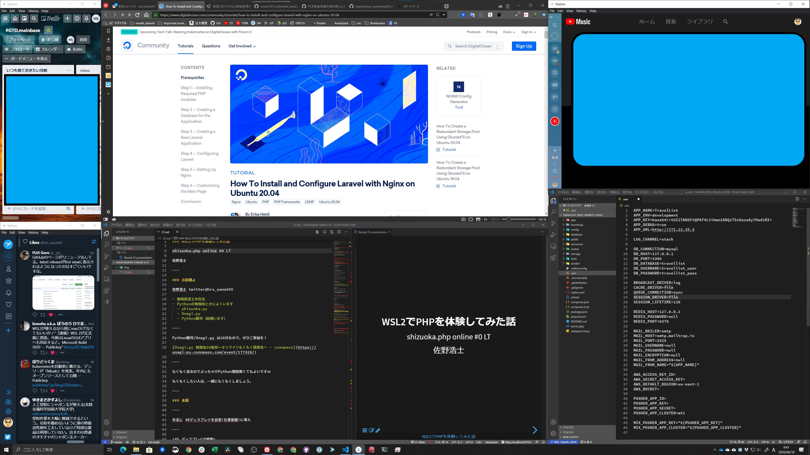
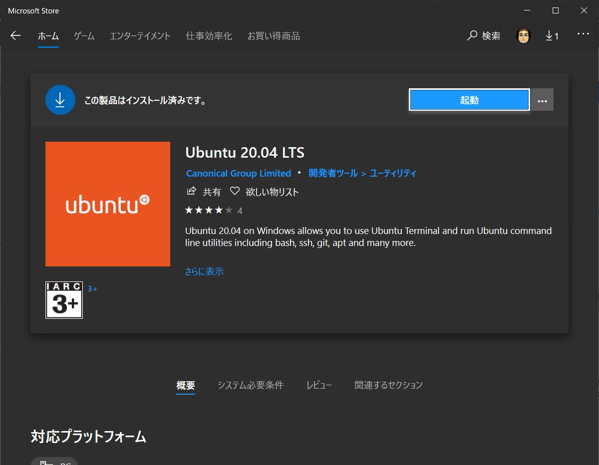
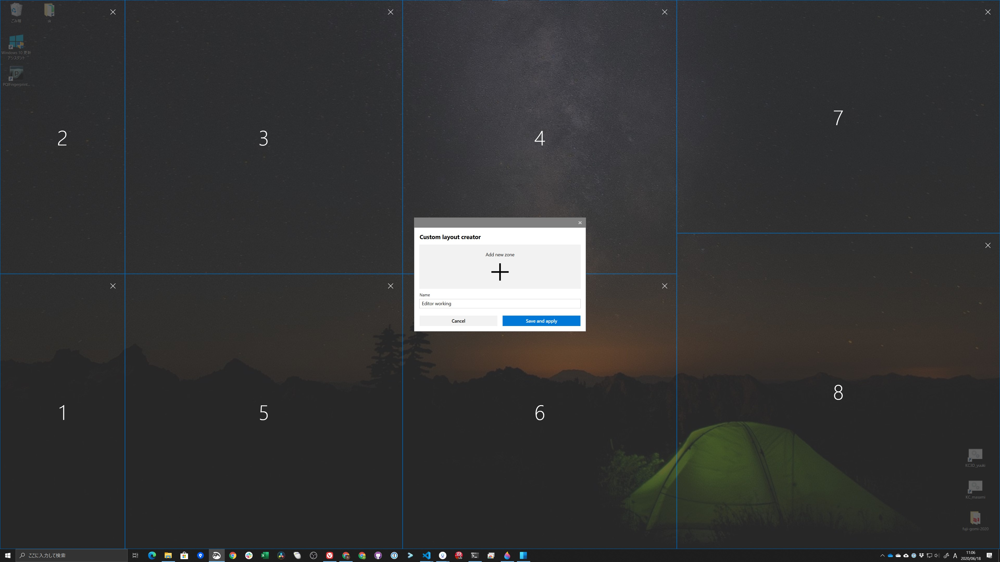

### WSL2でPHPを体験してみた話

shizuoka.php online #0 LT

佐野浩士

---

### お前誰よ

佐野浩士 twitter@hrs_sano645

- 静岡県富士市在住
- Pythonの勉強会とかによくいます
  - shizuoka.py
  - [Unagi.py](https://unagi-py.connpass.com/)
  - [Python駿河](https://py-suruga.connpass.com/)（よくいます）

---

Python駿河/Unagi.py は20日です。<br>
ぜひご参加を！

[Unagi.py 勉強会30枚目～オンラインもくもく読書会～ - connpass](https://unagi-py.connpass.com/event/177428/)

---

もくもく会なのでぶっちゃけ<br />Python関係無くてもよいですｗ

もくもくしたい人は一緒にもくもく<br />しましょう。

---

宣伝終わり🙇‍♂️

---

### 本題

---

4Kディスプレイを自室（仕事部屋）に導入

---



---

MBP2016だと4Kディスプレイでの作業きつすぎる。。

YouTube開くとコマ送りだし。。

---

MBP 16インチつよつよ構成は高いし...<br />
(400k Yen超えるし)




---

そこでWinのデスクマシンを活用！

- CPU: Corei 5 6200ぐらい
- メモリ: 16GB
- GPU: Radeon RX480

---



---

とっても快適！4Kディスプレイおススメです！


---

問題として: macOSでやってたUnixな作業がしづらい。。

---

Windows Subsystem for Linux2（WSL2）

正式リリース🎉

---

WSL2が正式版になったので<br>
インストールして使ってみよう

---

shizuoka.phpなので<br>
laravelのインストールまでやってみよう

---

やった作業

- **Windows 10 2004へアップデートが前提**
- WSL2のセットアップ
- LEMP, Laravelのセットアップ

---

WSL2のセットアップ:ここ見れば普通にできます。

-> [Windows Subsystem for Linux (WSL) を Windows 10 にインストールする | Microsoft Docs](https://docs.microsoft.com/ja-jp/windows/wsl/install-win10)

さらにわかりやすい -> [WSL2導入｜WinアップデートからWSL2を既定にするまでのスクショ - Qiita](https://qiita.com/tomokei5634/items/27504849bb4353d8fef8)

今後はカーネルの提供がWindows Update経由になる話があるので、ちょっと変わるかも？

---

OSはUbuntu 20.04を利用

MSストアから手に入ります（MSアカウント必要）




---

ディストリビューションのエクスポート/インポートもできる

```cmd
wsl --list # インストール済みのディストリビューション一覧が出てくる
  NAME            STATE           VERSION
* Ubuntu-20.04    Running         2
  Legacy          Stopped         1

wsl --export (ディストリビューション名) [ファイル名]
# tarで固まったファイルができます
# wsl --export Ubuntu-20.04 ub2004-wsl2-20200616

```

---

LEMP（と最近言うらしい） Linux, nginx, mysql, phpセットアップ

[How To Install Linux, Nginx, MySQL, PHP (LEMP stack) on Ubuntu 20.04 | DigitalOcean](https://www.digitalocean.com/community/tutorials/how-to-install-linux-nginx-mysql-php-lemp-stack-on-ubuntu-20-04)

Step3まで進めました

---

Laravelのセットアップ -> composerを入れて、Laravelのインストール

[How To Install and Use Composer on Ubuntu 20.04 | DigitalOcean](https://www.digitalocean.com/community/tutorials/how-to-install-and-use-composer-on-ubuntu-20-04)　Step2まで


[How To Install and Configure Laravel with Nginx on Ubuntu 20.04 | DigitalOcean](https://www.digitalocean.com/community/tutorials/how-to-install-and-configure-laravel-with-nginx-on-ubuntu-20-04)

---

### ここまでやってみた結果

---

Linuxマシンとほぼ変わらねえ！


（資料がUbuntuベースを見てましたが、ほぼ同じでした。）

---

### Tips:nginxが動くIP

WSL2のターミナルから探します

ubuntu(debian系)なら `ip a` でeth0がNICっぽいです

```bash
$ ip a
# ～～前略～
5: eth0: <BROADCAST,MULTICAST,UP,LOWER_UP> mtu 1500 qdisc mq state UP group default qlen 1000
    link/ether 00:15:5d:b0:18:d9 brd ff:ff:ff:ff:ff:ff
    inet 172.22.54.15/20 brd 172.22.63.255 scope global eth0
       valid_lft forever preferred_lft forever
    inet6 fe80::215:5dff:feb0:18d9/64 scope link 
       valid_lft forever preferred_lft forever
```

---

### Tips:WSL2のサービス設定

- systemdではないっぽい: systemctlとかjournalctlではない

- init.dっぽい: serviceコマンドが通りました

（ググるとWSLの時代からsystemdは動かない状態らしい<br />
 -> https://github.com/microsoft/WSL/issues/994 ）

---

### Tips: Windows Terminalも便利

WSL(2)でインストールしたディストリビューションも一覧で出してくれる


---

# まとめ

---

WSL2でターミナル環境を作って<br>
快適なUnix生活を送ろう！

---

# 以上

---

### おまけ

もし余ったら / お茶濁し用

---

大きい画面を手に入れたら、PowerToysのFancyZoneを設定しよう！

[microsoft/PowerToys: Windows system utilities to maximize productivity](https://github.com/microsoft/PowerToys)

---



---

おまけ2

---

WSL2 + VS Code の連携もやってみた

---

WSL2とVS Codeの連携は Remote-WSL拡張機能で実現できます

[Remote - WSL - Visual Studio Marketplace](https://marketplace.visualstudio.com/items?itemName=ms-vscode-remote.remote-wsl)

---


---

Win10開発環境にがっつり使えると思う！<br>
WSL2とVS Codeで快適開発環境を目指そう！

---

ちなみにVS Code + Remote-SSHも便利でおススメ！

（Remote-Containerも便利だと思われます）

---

終わり